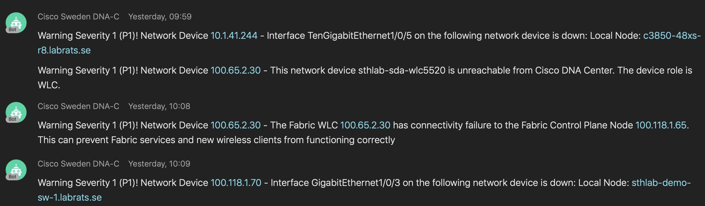

# cisco-dnac-platform-webex-notifications
[](https://developer.cisco.com/codeexchange/github/repo/robertcsapo/cisco-dnac-platform-webex-notifications)
## Receive Events from Cisco DNA-C and push the information to Cisco Webex Teams

## Disclaimer
* This solution isn't using Username/Password header with Cisco DNA-C (let me know if needed)
* Host this solution behind something that handles encryption (TLS) - else the payload is unencrypted from Cisco DNA-C



## How to setup
### Python Webhook
#### Prerequisites
* Docker support
* Cisco Webex Teams Token and Teams ID
	- How-To Guide https://developer.webex.com/docs/api/getting-started

### Start Python Webhook
```
docker run -d -p 5000:5000 -e WEBEX_TEAMS_ACCESS_TOKEN="TOKEN" -e WEBEX_TEAMS_ROOM_ID="ID" robertcsapo/cisco-dnac-platform-webex-notifications
```
### Cisco DNA-C
#### Prerequisites
* Enable Cisco DNA-C as a Platform
	- How-To Guide https://www.cisco.com/c/en/us/td/docs/cloud-systems-management/network-automation-and-management/dna-center-platform/1-2-5/user_guide/b_dnac_platform_ug_1_2_5/b_dnac_platform_ug_1_2_5_chapter_01.html
* Enable "Network Events for REST API Endpoint" Bundle

#### Configuration
* Configure "Network Events for REST API Endpoint"
* Choose "Create a new instance" and point to your Python Webhook instance (http://localhost:5000/dnac (POST) as URL, or your FQDN Loadbalancer)
	- https://www.cisco.com/c/en/us/td/docs/cloud-systems-management/network-automation-and-management/dna-center-platform/1-2-5/user_guide/b_dnac_platform_ug_1_2_5/b_dnac_platform_ug_1_2_5_chapter_011.html#id_75394
	- https://www.cisco.com/c/en/us/td/docs/cloud-systems-management/network-automation-and-management/dna-center-platform/1-2-5/user_guide/b_dnac_platform_ug_1_2_5/b_dnac_platform_ug_1_2_5_chapter_0110.html
* Activate "Schedule to publish Network Events - REST Endpoint connector"
	- Developer Toolkit
		- Integration Flows
			- Click on "Schedule to publish Network Events - REST Endpoint connector"
			- Customize your settings and press "Resume"


## Troubleshooting
### Sample - /sample URL (GET)
#### GET http://localhost:5000/sample
Sends Sample data from outputdata.json
#### Response
```Sample JSON Payload received```

### Webex - /webex URL (GET)
#### GET http://localhost:5000/webex
Sends Sample data to Webex Room
#### Response
```Sample Webex Teams Message```

### Post Sample (POST) - /postsample URL
#### POST http://localhost:5000/postsample
Send your own JSON sample data (use POST Method and Postman)
#### POST JSON Sample Data (through Postman or curl)
```
{
	"id": "AWZJw6y7OyE4MOPs83V-",
	"instanceId": "E-NETWORK-EVENT-AWZJw6y7OyE4MOPs83V--1538835787576",
	"category": "Warn",
	"status": "NEW",
	"timestamp": 1538835787576,
	"severity": "P1",
	"domain": "Availability",
	"source": "DNAC",
	"priority": "P1",
	"type": "Network",
	"title": "Device unreachable",
	"description": "This network device {network_device} is unreachable from controller. The device role is {fabricOrDeviceRole}.",
	"actualServiceId": "100.68.0.66",
	"assignedTo": "",
	"enrichmentInfo": {
		"issueDetails": {
			"issue": [{
				"issueId": "AWZJw6y7OyE4MOPs83V-",
				"issueSource": "Cisco DNA",
				"issueCategory": "Availability",
				"issueName": "snmp_device_down",
				"issueDescription": "This network device {network_device} is unreachable from controller. The device role is {fabricOrDeviceRole}.",
				"issueEntity": "network_device",
				"issueEntityValue": "100.68.0.66",
				"issueSeverity": "HIGH",
				"issuePriority": "",
				"issueSummary": "Network Device 100.68.0.66 Is Unreachable From Controller",
				"issueTimestamp": 1538835787576,
				"suggestedActions": [{
					"message": "From the controller, verify whether the last hop is reachable.",
					"steps": []
				}, {
					"message": "Verify that the physical port(s) on the network device associated with the network device discovery(IP) is UP.",
					"steps": []
				}, {
					"message": "Verify access to the device.",
					"steps": []
				}],
				"impactedHosts": [{
					"hostName": "Unknown",
					"hostOs": "Unknown",
					"ssid": "Unknown",
					"connectedInterface": "Unknown",
					"macAddress": "100.67.0.35",
					"failedAttempts": 3,
					"location": {
						"siteId": "UNASSIGNED",
						"siteType": "BUILDING",
						"area": "Global",
						"building": "UNASSIGNED",
						"apsImpacted": []
					},
					"timestamp": 1538835787576
				}, {
					"hostName": "Unknown",
					"hostOs": "Unknown",
					"ssid": "Unknown",
					"connectedInterface": "Unknown",
					"macAddress": "100.69.0.68",
					"failedAttempts": 3,
					"location": {
						"siteId": "UNASSIGNED",
						"siteType": "BUILDING",
						"area": "Global",
						"building": "UNASSIGNED",
						"apsImpacted": []
					},
					"timestamp": 1538835787576
				}, {
					"hostName": "Unknown",
					"hostOs": "Unknown",
					"ssid": "Unknown",
					"connectedInterface": "Unknown",
					"macAddress": "100.68.0.66",
					"failedAttempts": 3,
					"location": {
						"siteId": "UNASSIGNED",
						"siteType": "BUILDING",
						"area": "Global",
						"building": "UNASSIGNED",
						"apsImpacted": []
					},
					"timestamp": 1538835787576
				}, {
					"hostName": "Unknown",
					"hostOs": "Unknown",
					"ssid": "Unknown",
					"connectedInterface": "Unknown",
					"macAddress": "100.68.0.67",
					"failedAttempts": 3,
					"location": {
						"siteId": "UNASSIGNED",
						"siteType": "BUILDING",
						"area": "Global",
						"building": "UNASSIGNED",
						"apsImpacted": []
					},
					"timestamp": 1538835787576
				}, {
					"hostName": "Unknown",
					"hostOs": "Unknown",
					"ssid": "Unknown",
					"connectedInterface": "Unknown",
					"macAddress": "100.66.10.35",
					"failedAttempts": 3,
					"location": {
						"siteId": "UNASSIGNED",
						"siteType": "BUILDING",
						"area": "Global",
						"building": "UNASSIGNED",
						"apsImpacted": []
					},
					"timestamp": 1538835787576
				}, {
					"hostName": "Unknown",
					"hostOs": "Unknown",
					"ssid": "Unknown",
					"connectedInterface": "Unknown",
					"macAddress": "100.65.253.18",
					"failedAttempts": 3,
					"location": {
						"siteId": "UNASSIGNED",
						"siteType": "BUILDING",
						"area": "Global",
						"building": "UNASSIGNED",
						"apsImpacted": []
					},
					"timestamp": 1538835787576
				}, {
					"hostName": "Unknown",
					"hostOs": "Unknown",
					"ssid": "Unknown",
					"connectedInterface": "Unknown",
					"macAddress": "100.67.0.34",
					"failedAttempts": 3,
					"location": {
						"siteId": "UNASSIGNED",
						"siteType": "BUILDING",
						"area": "Global",
						"building": "UNASSIGNED",
						"apsImpacted": []
					},
					"timestamp": 1538835787576
				}]
			}]
		},
		"connectedDevice": [{
			"deviceDetails": {
				"cisco360view": "https://100.65.1.10/dna/assurance/home#networkDevice/undefined"
			}
		}]
	}
}
```
#### Response
```Sample JSON Payload received```
